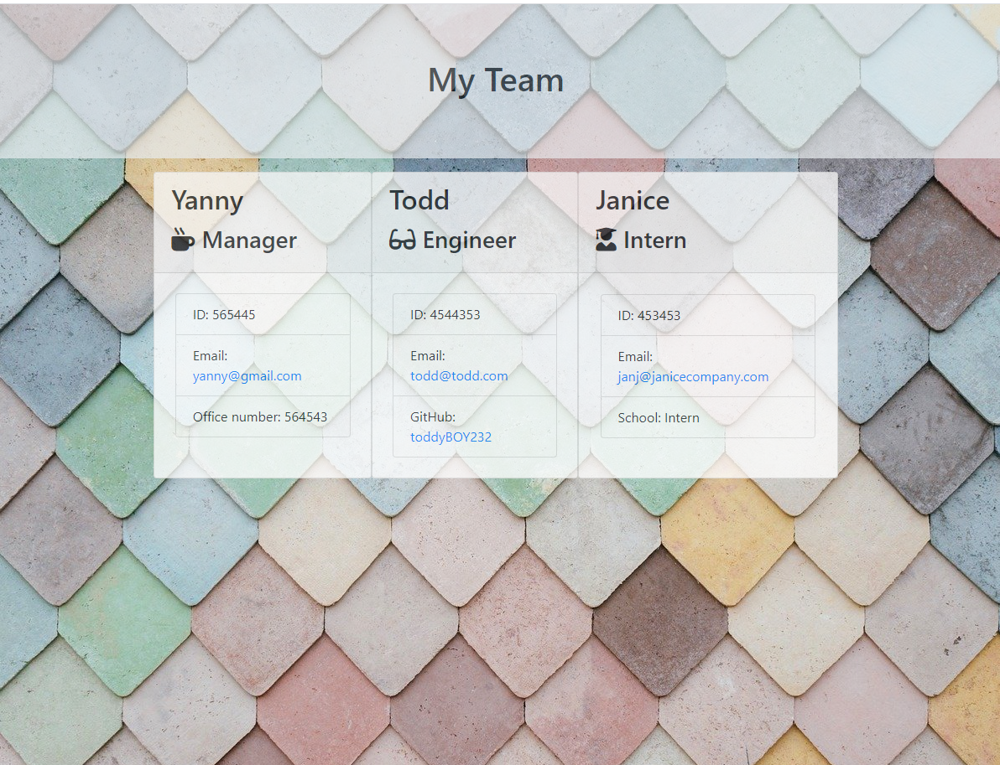
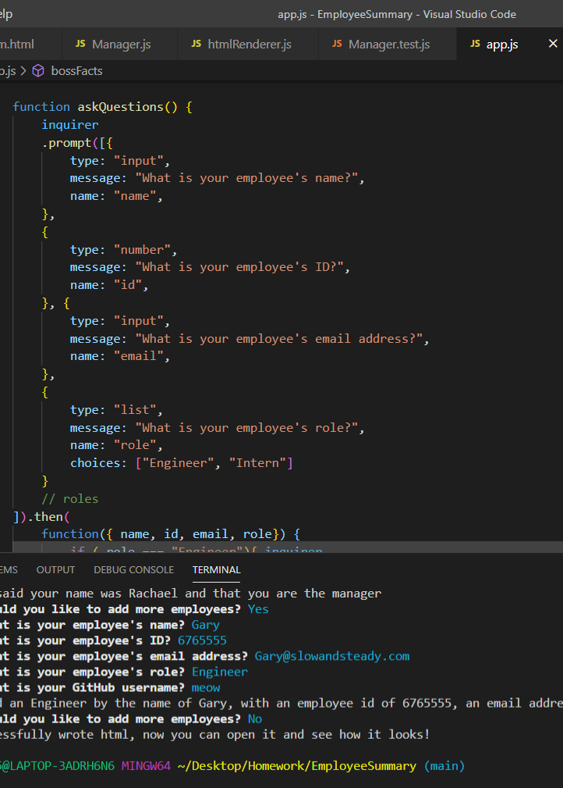

#  Employee Summary

### A simple app that helps keep track of basic employee information
<!-- Add finished image here -->

## Table of Contents
* [Getting Started](#getting-started)

* [Technologies Used](#technologies-used)
* [Features](#features)
* [Usage](#usage)
* [Authors](#authors)
* [Credits](#credits)
* [License](#license)

## Getting Started
In order to get started using this app you may want to watch this video or you can follow the instructions below

[Usage Demo Video](https://drive.google.com/file/d/1KW-QAwyMhQYoDRJ0Fcy5gVDdQiYYOfxE/view)

_Written Instructions_

In order to use this code you will need to open the files using vs code(or a similar IDE but I cannot garuntee my instructions being helpful for anything else.) Once you have everything open in your explorer, right click app.js and select "Open Integrated Terminal". Below, the code a terminal should pop-up go ahead and make sure you have the correct terminal for further information on what the correct terminal is [click here](https://code.visualstudio.com/docs/nodejs/nodejs-tutorial). 
Next you want to type in a series of commands to set up your terminal and load your files. Make sure to hit enter after each item and wait for it to process.
*_1st_ npm install  
*_2nd_ npm install inquire 
*_3rd_ npm install  jest
*_4th_ npm init -y 
Once you are set-up, you can enter in node app.js.

Then simply follow along with the prompts. When your prompts are finished, go to the output folder and find the file labeled "team.html". Right click team.html and in the pop-up window, select "Open in Default Browser" -if you are unhappy with your entries you may select the garbage can in the top right corner of your terminal and start again.
For further questions how to operate node.js:
You can check out this [link](https://www.tutorialsteacher.com/nodejs/nodejs-tutorials)
You can contact me
You can google "node.js" or "npm"
## Technologies Used
* HTML (32.0%)
* CSS (20.0%)
* Javascript (48.0%) 
* [node.js](https://www.npmjs.com/)

## Features 

### __1.Prompts in the terminal__
  

This app features a series of questions that guide the use to an end output. 
### __2. HTML Self-generator__

This app features html that is written as part of the code when it runs rather than having any hard coded information. Whenever it is run again, it rights over the previous 
 

### __4. Other__

 __For later builds__

_A peice of code pulls employee pictures_

When you have a large team, pictures are super beneficial- and more fun to customize things.

_A better CSS sheet_

The design on this is minimal and not as functional as I would like it to be. Given another couple of days this little tool could really pop design-wise. 

_The ability to toggle what you want to see_

For instance, if you only wanted to look at Engineers, being able to hide interns would be helpful. If you only wanted to look at interns from a specific institution, that could be helpful too. When teams get bigger this tool becomes less and less useful to manage employee information. 

_The ability to get more details about employees_

A little drop down in the list would be cool, so that you could store custom info like birthdays, skills or current projects. 

## Usage

## Authors

 
 Rachael Kelm-Southworth: 

* [linkedin] (https://www.linkedin.com/in/rachael-kelm-southworth-87a3831b3) 

* [github] (https://github.com/RKSouth/)

 ## Credits

I would like to thank Kerwin, Manuel, Roger, and all of our classmates for helping us understand this subject matter and anyone that contributed to make the base code.

## License
[MIT](https://choosealicense.com/licenses/mit/)

